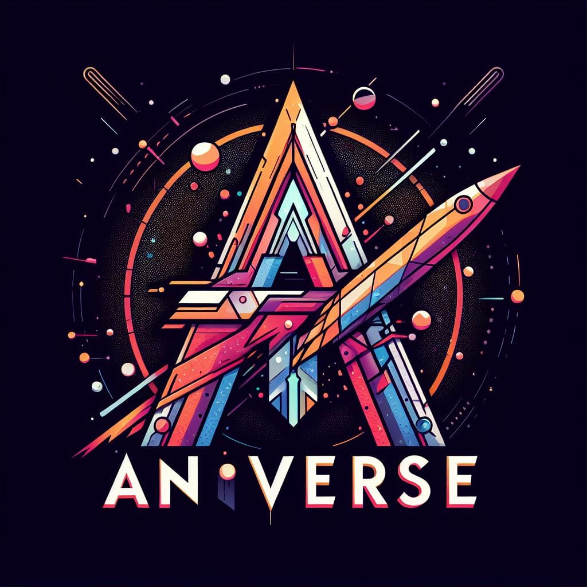
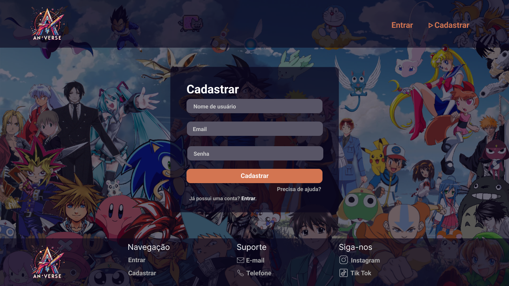
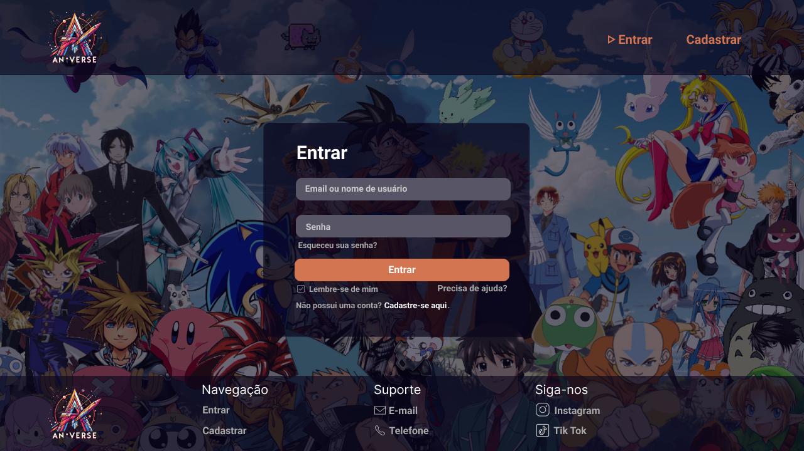
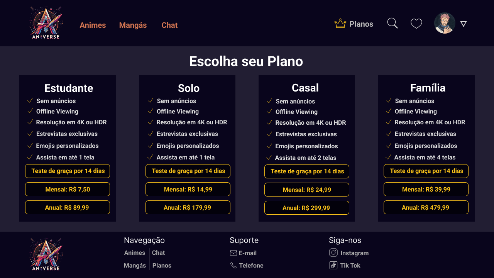

# ANIVERSE

 Um projeto feito por alunos da Etec de Santa Isabel, pautado no Design Thinking para a disciplina de Usabilidade e Design de Interação 

## Índice
- <a href="#funcionalidades-do-projeto">Funcionalidades do Projeto </a>
- <a href="#layout"> Layout </a> 
- <a href="#tecnologias-utilizadas"> Tecnologias Utilizadas </a> 
- <a href="#autores"> Autores </a> 
- <a href="#próximos-passos"> Próximos Passos </a>

## Funcionalidades do Projeto
- [x] Cadastro de Usuário
- [x] Login
- [x] Assistir Animes
- [x] Assistir Mangás
- [x] Conversas em Chat
- [x] Escolha de Planos de Usuário

## Layout
- Página Inicial

- Página de Cadastro

- Página de Login

- Página de Animes 1

- Página de Animes 2

- Página de Mangás 1

- Página de Mangás 2

- Página de Chat

- Página de Planos

## Tecnologias Utilizadas
1. [Word](https://www.microsoft.com/pt-br/microsoft-365/word)
2. [Figma](https://www.figma.com/)
3. [Miro](https://miro.com/pt/)
4. [Canva](https://www.canva.com/pt_br/)

## Autores
- Fernando Ferreira da Silva

- João Pedro de Paula Silva

- Júlio Manoel Reis Lucena

- Nicoly Júlia de Oliveira

- Thalita Soares Barbosa

## Próximos Passos
- [ ] Desenvolver Páginas Web do Projeto
- [ ] Criar novas Páginas
